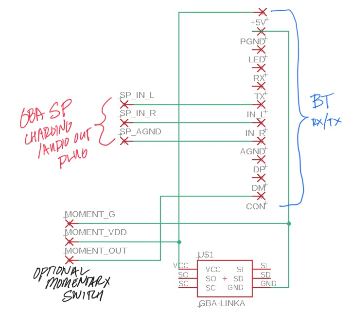

GBA SP Bluetooth Audio Transmitter
===========

Parts needed
-------------------
* GBA SP plug/audio cable sourced from: ([GBA SP Audio Adapter](https://en.wikipedia.org/wiki/Game_Boy_Advance_SP#/media/File:Nintendo-Game-Boy-Advance-Headphone-Adapter.jpg))
* GBA Link Plug, need to de-solder from one of the following: ([Link Cable](https://en.m.wikipedia.org/wiki/GameCube_%E2%80%93_Game_Boy_Advance_link_cable) | [Wireless Adapter](https://en.m.wikipedia.org/wiki/Game_Boy_Advance_Wireless_Adapter))
* DIY bt audio module: ([4.1 BT Transmitter Module, KCX_BT_EMITTER 5V](https://www.aliexpress.com/item/33058710334.html?spm=a2g0s.9042311.0.0.52ea4c4dOgsJLK) | [Need to find Aipods compatible version](about:blank))
* PCB made diy or eventually osh park...

Find the cheapest plug you can via GBA-GB link cable, I have not tried taking apart a link cable to scavenge those plugs, I am not sure if they will have PCB through hole pins. Using Wireless Adapters can get expensive unless you want to use the larger case!

You can find tons of SP audio cables on eBay for cheap.

Repository Contents
-------------------
* **/Eagle Files** - Eagle Project, board and schematic

Links/Sources
-------------------
* [/r/Gameboy](https://www.reddit.com/r/Gameboy/)
* [Gameboy Advance Headphone Jack Mods](https://github.com/rorosaurus/gba-sp-headphone-jack)
* [/u/mmaxeator's intermal bt mod](https://web.archive.org/web/20201025163111/https://mmax.tech/?p=3895&lang=en)

toDo
-------------------
* better traces for mill for bt_tx pcb
* find bt_tx that works with airpods
* fit whole circuit in GBA wireless adapter?
* 3D model casing for circuit?

brief history
-------------------
There have been many posts on reddit of people doing similar stuff, I'm just trying to compile what I've learned contacting others and seeing what people are doing in the modding community.

people
-------------------
* bk brandonklevence@gmail.com

License Information
-------------------
The hardware is released under [Creative Commons Share-alike 3.0](http://creativecommons.org/licenses/by-sa/3.0/).
All other code is open source hardware so please feel free to do anything you want with it;
you buy me a beer if you use this and we meet someday ([Beerware license](http://en.wikipedia.org/wiki/Beerware)).
